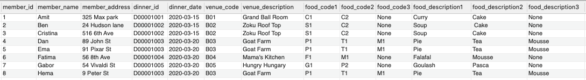
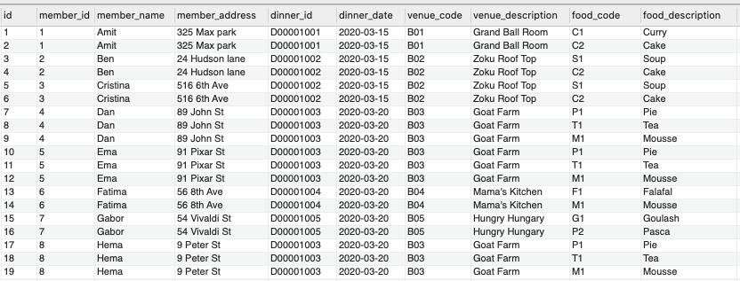
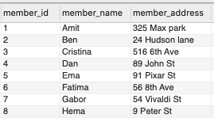
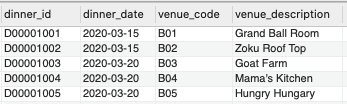
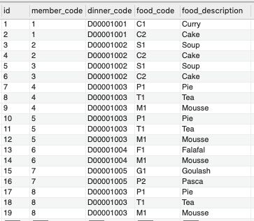
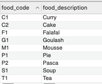
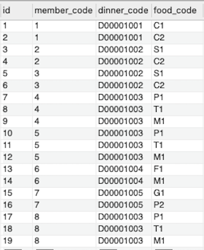

# 1-How can you convert the table into 1NF ?

## Rule 1 : Single valued attributes (each column should have atomic value, no multiple values)
- food_code and food_description columns have multiple values. So we need to create new column for each value.

## Rule 2 : Attribute domain should not change
- In each column the values were stored at the same type.

## Rule 3 : Unique names for attributes / columns
- food_code1,food_code2,food_code3 and food_description1,food_description2,food_description3 columns have not got unique names. So we need to create unique names for  columns such as that "id,member_id, member_name, member_address, dinner_id, dinner_date, venue_code, venue_description, food_code, food_description "

## Rule 4 : Order does not matter
- The order which we store the data in the table doesn't matter.

Using the First Normal Form, data redundancy increases, as there will be many columns with same data in multiple rows but each row as a whole will be unique.

# 2-What are the super, candidate, primary keys in the table created in step (1)?
- Super Key is defined as a set of attributes within the table that can uniquely identify each record within a table. The maximum number of super keys possible is 2**10 =1024

So, some of the super keys are below.
 
{id},{id, ...all set of attributes with id },    
{member_id, dinner_id, venue_code, food_code}

- Candidate keys are defined as the minimal set of fields which can uniquely identify each record in a table.

So, the candidate keys are below.
 
{member_id,diner_id,food_code},  
{member_name,diner_id,food_description}

- Primary key is a candidate key that is most appropriate to become the main key for any table    
So, the primary key is {id}.

# 3-How can you develop the set of 2NF tables? (Think of relationships between different tables).

## Rule 1  : The table should be in the First Normal Form.

## Rule 2 : There should be no Partial Dependency.
- The table also should not contain partial dependency. Here partial dependency means the proper subset of candidate key determines a non-prime attribute. 

- In this case, member_name and member_address only depend on member_id.
Also, dinner_date, venue_code, venue_description depend on dinner_id.Therefore, this table does not satisfy the second Normal Form. to make that database comply with the 2NF, we have to split up the table into three smaller tables.

* members table : member_id is Primary Key of the table.
 

* dinners table : dinner_id is Primary Key of the table.
 

* main table : id is Primary Key of the table.member_code is Foreign Key which references the primary key(member_id) of members table! Also, dinner_code is Foreign Key which references the primary key(dinner_id) of dinners table!
 

# 4-How can you develop the set of 3NF tables?
## Rule 1  : It should be in the Second Normal form.
## Rule 2  : it should not have Transitive Dependency.
- The condition is there should be no transitive dependency for non-prime attributes. That means non-prime attributes (which doesn’t form a candidate key) should not be dependent on other non-prime attributes in a given table.

The functional dependency {id} → {food_description} applies; that is, if we know the id, we know the food_description. Furthermore:

{id} → {food_code}  
{food_code} does not → {id}   
{food_code} → {food_description}  
Therefore {id} → {food_description} is a transitive dependency.

Transitive dependency occurred because a non-key attribute (food_code) was determining another non-key attribute (food_description).

* foods table : food_code is Primary Key of the table.
 

- as a result main table for 3NF should be that below. Also, food_code is Foreign Key which references the primary key(food_code) of foods table!
 

